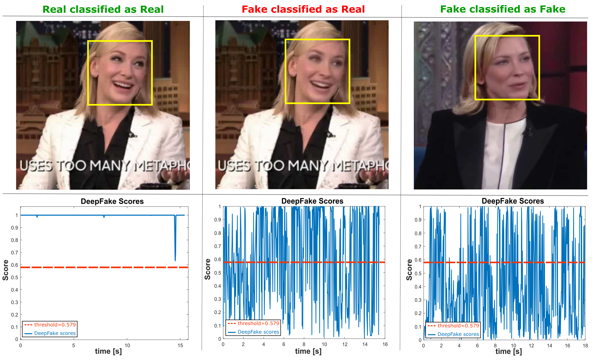

# The Real Eye: A rPPG Based Multi-Model Deepfake Detection System


## The Real Eye: A rPPG Based Multi-Model Deepfake Detection System is based on the research paper [DeepFakesON-Phys: DeepFakes Detection based on Heart Rate Estimation](https://arxiv.org/pdf/2010.00400.pdf)


## Overview
The <b>Real Eye</b> is a rPPG (remote Photoplethysmography) based Multi-Model (both audio and video) Deepfake Detection System. It is based on the research paper [DeepFakesON-Phys: DeepFakes Detection based on Heart Rate Estimation](https://arxiv.org/pdf/2010.00400.pdf). It effectively detects deepfakes in videos using the extracted rPPG signals from the preprocessed videos.


For further detail you can consult [DeepFakesON-Phys](https://arxiv.org/pdf/2010.00400.pdf).



## Access

### Configuring environment in Windows:

1. Create a new environment:

    ```bash
    conda create -n [env-name] python=3.9
    ```

2. Activate the environment:

    ```bash
    conda activate [env-name]
    ```

3. Install the dependencies:

    ```bash
    pip install -r requirements.txt
    ```

3) If you want to use a CUDA compatible GPU for faster predictions you will need CUDA and the Nvidia drivers installed in your computer: https://docs.nvidia.com/deeplearning/sdk/cudnn-install/


### Using The Real Eye Video Deepfake Detection Service

  1) Download or clone the repository.
  2) Activate your conda environment and run the `app.py` file in the `Video Deepfake Detection Service/src/` folder.This will start a flask server running on your locaalhost on port `5000`
  3) Open postman or anyother API testing tools and give a `POST` request to the route `http://127.0.0.1:5000/upload` and include your video file under the body form data with field name equals to `video`. The response will include the video name and prediction returned as json.

### Using The Real Eye Audio Deepfake Detection Service

  1) Download or clone the repository.
  2) Activate your conda environment and run the `app.py` file in the `Audio Deepfake Detection Service/` folder.This will start a flask server running on your locaalhost on port `5001`
  3) Open postman or anyother API testing tools and give a `POST` request to the route `http://127.0.0.1:5001/classify` and include your audio file under the body form data with field name equals to `file`. The response will include the prediction returned as json.

### Upcoming Updates:
  - React Frontend
  - Browser Extension

## Citation
```
@article{hernandez2020deepfakeson,
  title={DeepFakesON-Phys: DeepFakes Detection based on Heart Rate Estimation},
  author={Hernandez-Ortega, Javier and Tolosana, Ruben and Fierrez, Julian and Morales, Aythami},
  journal={arXiv preprint arXiv:2010.00400},
  year={2020}
}
